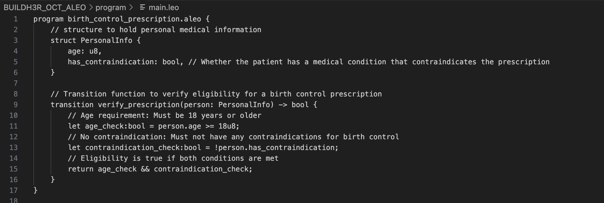
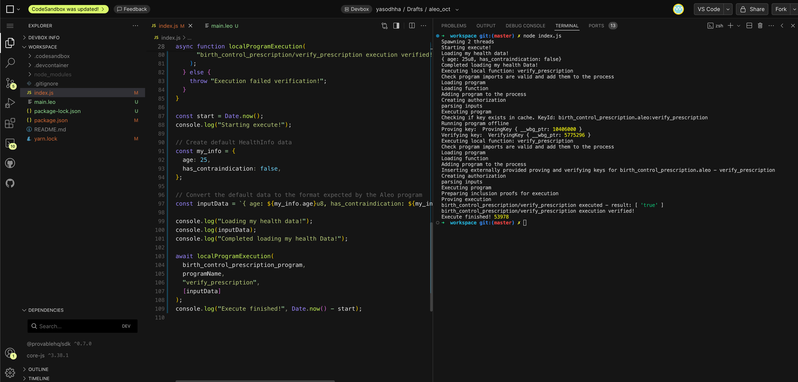
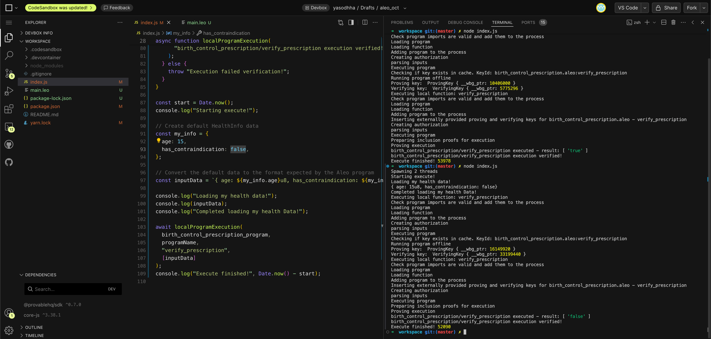

# Use Case: Confidential Birth Control Prescription Verification

## Overview

This use case focuses on verifying whether a woman is eligible for a birth control prescription based on specific conditions, such as age and medical contraindications, without revealing sensitive personal health data.

## Problem

Women seeking birth control may need to verify their eligibility based on:

- Age (must be of legal age, typically 18+)
- Lack of contraindicating medical conditions (such as a history of certain health issues that may conflict with hormonal contraceptives)

However, sharing this information with pharmacies, healthcare providers, or insurance companies may expose unnecessary personal details, leading to privacy concerns.

## Solution: Zero-Knowledge (ZK) Based Prescription Verification

Using Zero-Knowledge Proofs (ZKPs), we can allow a woman to privately verify her eligibility for birth control prescriptions. The solution involves the following:

1. **Personal Information**: The patient inputs essential health information, such as age and whether she has any contraindications for the birth control method.
2. **Verification**: A zero-knowledge proof is used to verify that the patient meets the criteria:
   - She is of legal age.
   - She does not have any medical contraindications.
3. **Privacy**: The proof only verifies the required conditions, revealing **no additional health data** (such as the exact age or specific medical history).

The verification system provides a **yes/no** response on prescription eligibility while keeping personal details fully confidential.

## Real-World Scenario

In a pharmacy setting:

1. A woman requests birth control.
2. Instead of sharing her full medical history, she provides a ZKP-based proof.
3. The system confirms whether she is eligible for the prescription (based on age and absence of contraindications).
4. The pharmacist receives only a "Yes" or "No" answer, without accessing her actual age or medical condition.

## Leo Code

## Result

- Success ZKP Proof

- Failed ZKP Proof
  

## Conclusion

By utilizing zero-knowledge proofs, we can create a **secure and privacy-preserving** system for verifying birth control prescription eligibility, ensuring that women’s health data remains confidential while allowing access to necessary healthcare.
